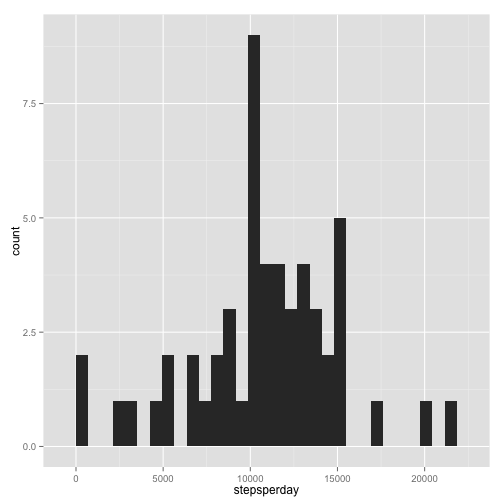
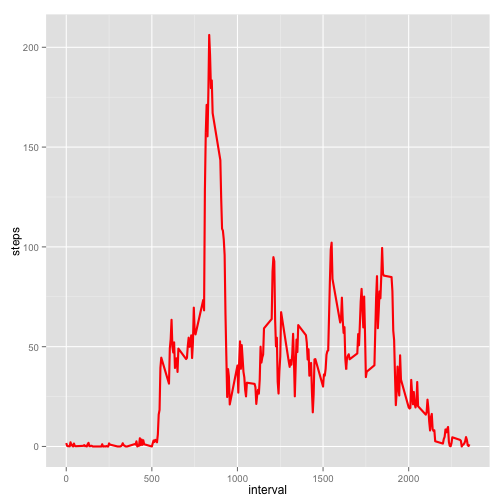
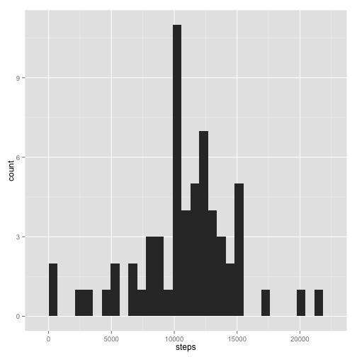
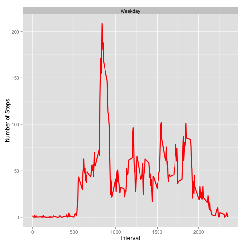

# Reproducible Research: Peer Assessment 1


## Loading and preprocessing the data

```r
library(ggplot2)
rawdata <- read.csv("~/Documents/coursera//R_computing/DS spec//Reproducible Research//RepData_PeerAssessment1//activity.csv", sep=',', na.strings="NA", header=T, colClasses = c("numeric", "Date", "numeric"))
rawdata$day<-weekdays(rawdata$date)
```


## What is mean total number of steps taken per day?
Histogram of total number of steps taken each day

```r
steps_per_day<-tapply(rawdata$steps, rawdata$date, sum)
stepsperday<-unlist(steps_per_day)
qplot(stepsperday)
```

```
## stat_bin: binwidth defaulted to range/30. Use 'binwidth = x' to adjust this.
```

 

Median of total number of steps taken each day

```r
# Mean
mean(stepsperday, na.rm=T)
```

```
## [1] 10766
```

```r
# Median
median(stepsperday, na.rm=T)
```

```
## [1] 10765
```

## What is the average daily activity pattern?
Average number of steps made per interval


```r
stepsperinterval <- aggregate(steps ~ interval, data=rawdata, mean, na.rm = TRUE)
ggplot(stepsperinterval, aes(x=interval,y=steps)) + geom_line(color="red", size=1)
```

 


And the most active 5-minute interval is

```r
stepsperinterval[which.max(stepsperinterval$steps),]$interval
```

```
## [1] 835
```
## Imputing missing values


```r
sum(is.na(rawdata))
```

```
## [1] 2304
```

The method is simple: assuming that in different weekdays we walk different amount of steps
We imput for each 5-min interval the average number of steps per such interval in a concrete day of week


```r
avstperday <- aggregate(steps ~ interval + day, rawdata, mean, na.rm = TRUE)
data <- merge(rawdata, avstperday, by=c("interval", "day"))
data <- transform(data, steps.x = ifelse(is.na(steps.x),steps.y,steps.x))
data <- data.frame(data[,1:4])
names(data) <- c("interval", "day","steps", "date")
data$steps <- round(data$steps, digits = 0)
data <- data[order(data$date, data$interval),]
```

Histogram of total number of steps taken each day


```r
datasplitbyday <- aggregate(steps ~ date, data, sum, na.rm = TRUE)
qplot(steps, data = datasplitbyday)
```

```
## stat_bin: binwidth defaulted to range/30. Use 'binwidth = x' to adjust this.
```

 

Mean and median for new data

```r
#Mean
mean(datasplitbyday$steps)
```

```
## [1] 10821
```

```r
#Median
median(datasplitbyday$steps)
```

```
## [1] 11015
```

## Are there differences in activity patterns between weekdays and weekends?


```r
data$daytype <- ifelse(data$day %in% c("Saturday", "Sunday"),"Weekend", "Weekday")
dataaggregated <- aggregate(steps ~ interval + daytype, data, mean)
ggplot(dataaggregated, aes(x=interval,y=steps)) + geom_line(color="red",size=1) + 
facet_wrap(~daytype, nrow=2, ncol=1) + 
labs(x="Interval",y="Number of Steps")
```

 
